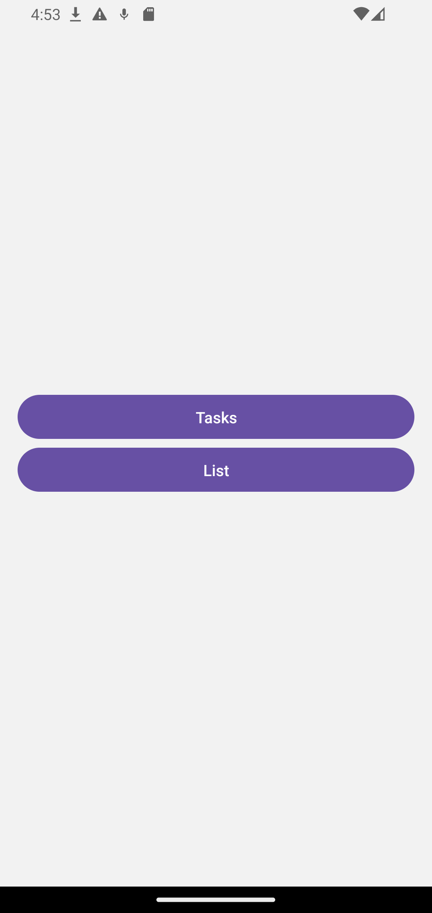
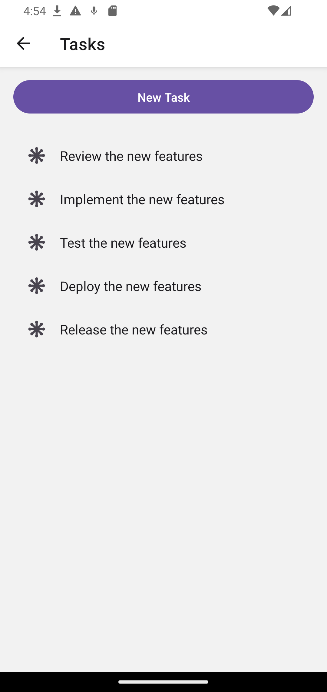
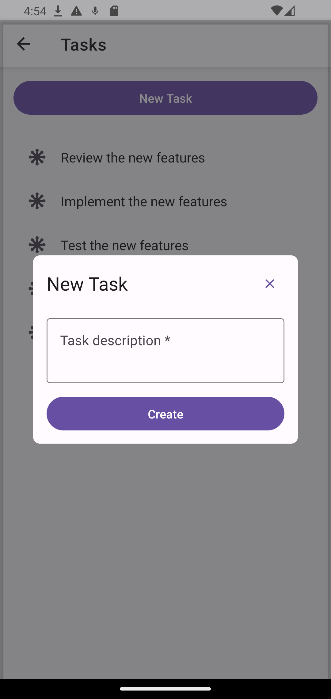
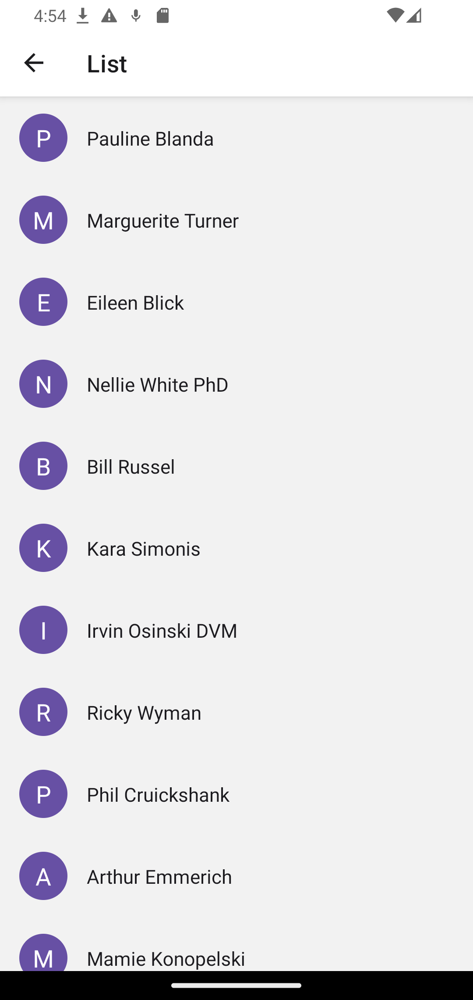
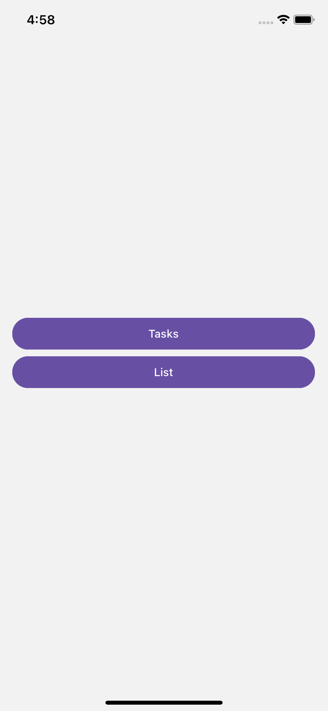
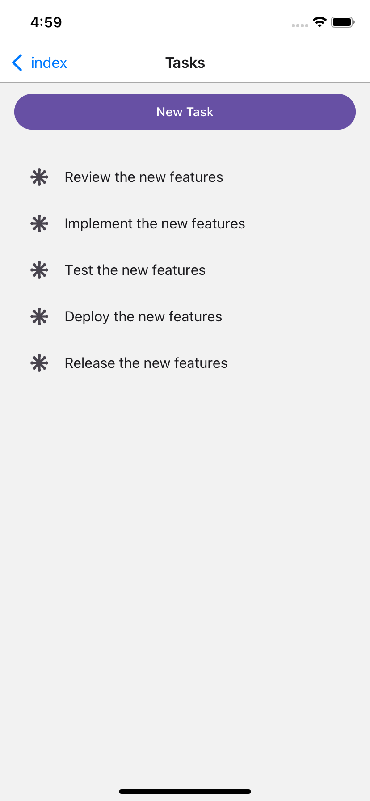
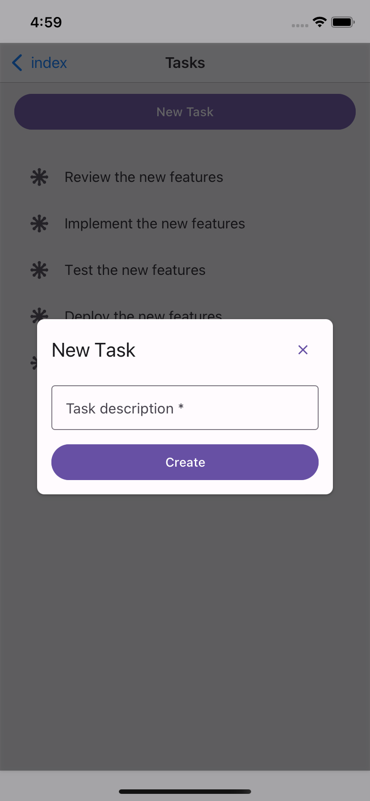
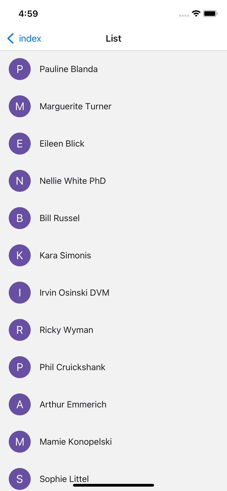

# React Native Task and List App


### Android






### iOS






## Description

The challenge is to create a simple application in React Native that includes the following functionalities:

- A "tasks" section, which is a simple list of tasks added by the user (only containing a description), with the option to add more tasks.
- A "list" section, which will simply make a request to a remote data list and render it on the screen.

The main screen contains 2 buttons used to navigate to the screens of each of the mentioned sections.

## Functionalities

- Tasks:
  - Create a list of tasks in a Redux context.
  - Read and display data present in Redux.
  - Add new tasks via a modal with a form.
  - Validation to prevent adding tasks with empty descriptions.
  - Persist tasks when navigating between screens.
- List:
  - Display a list of items fetched from a remote data source.
  - Display at least the name of each item and optionally an image in the "contact list" style.
  - Show a loading state while fetching the data.

## Architecture

This project uses Redux Toolkit for global state management and Axios for HTTP requests.

This codebase follows the Hexa3 architecture, which is a combination of Hexagonal Architecture and Domain-Driven Design (DDD) principles. This architecture promotes a clean separation of concerns and a modular design, making the codebase more maintainable and scalable.

### Folder Structure

```bash
├── app -> (contains routes pages)
├── domain
│   ├── constants -> (contains regex constants)
│   ├── polyfills -> (contains JS polyfills)
│   └── store -> (contains application state and actions)
├── infra
│   └── services -> (contains APIs services)
└── ui
    ├── assets -> (contains fonts and image assets)
    ├── components -> (contains UI components)
    └── layouts -> (contains UI Layouts)
```

## Tech Stack

- [React](https://reactjs.dev/)
- [React Native](https://reactnative.dev/)
- [Expo](https://expo.dev/)
- [Redux Toolkit](https://redux-toolkit.js.org/)
- [React Native Paper](https://callstack.github.io/react-native-paper/)
- [Axios](https://axios-http.com/)
- [Testing Library](https://testing-library.com/)
- [Eslint](https://eslint.org/)
- [Typescript](https://www.typescriptlang.org/)

## Additional Resources

- Mock data API : [https://6172cfe5110a740017222e2b.mockapi.io/elements](https://6172cfe5110a740017222e2b.mockapi.io/elements)

## Run the app

1. Install dependencies

   ```bash
   npm install
   ```

2. Start the app

   ```bash
    npx expo start
   ```

In the output, you'll find options to open the app in a

- [development build](https://docs.expo.dev/develop/development-builds/introduction/)
- [Android emulator](https://docs.expo.dev/workflow/android-studio-emulator/)
- [iOS simulator](https://docs.expo.dev/workflow/ios-simulator/)
- [Expo Go](https://expo.dev/go), a limited sandbox for trying out app development with Expo

## Run the tests

To run the tests, use the following command:

```bash
npm run test
```